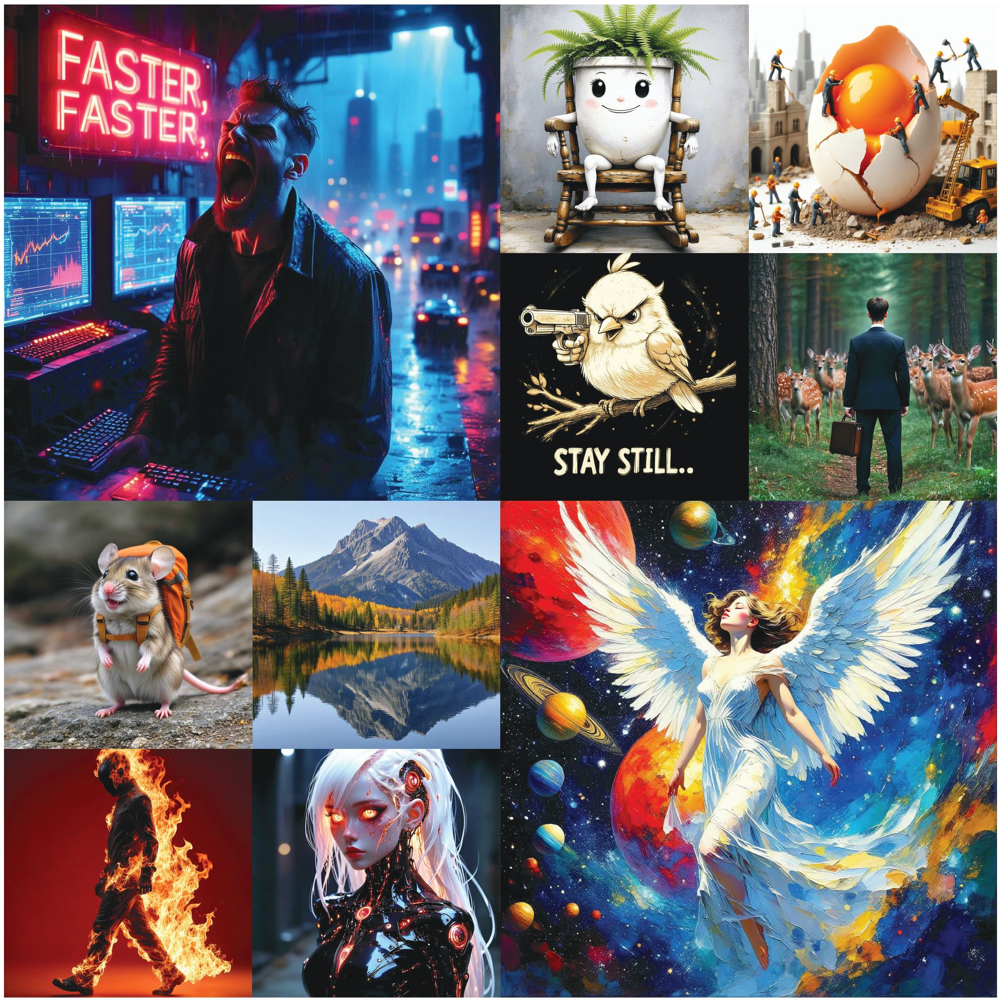
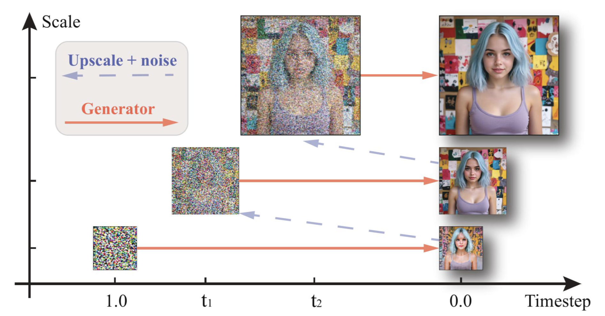
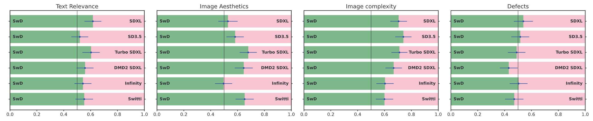

# Scale-wise Distillation of Diffusion Models

<a href='https://arxiv.org'></a> &nbsp; 
<a href='https://yandex-research.github.io/swd/'></a> &nbsp; 
<a href="https://huggingface.co/spaces/dbaranchuk/Scale-wise-Distillation">
	    
</a>&nbsp;

<p  align="center">
⚡️ <b> SwD is twice as fast as leading distillation methods </b> <br> 
⚡️ <b> SwD surpasses leading distillation methods within the same computational budget </b>
<p >

<p align="center">

</p>

## 💡 Quick introduction
The paper introduces Scale-wise Distillation (SwD), a novel framework for accelerating 
diffusion models (DMs) by progressively increasing spatial resolution during the generation process. 
SwD achieves significant speedups (2.5× to 10×) compared to full-resolution models while maintaining or even improving image quality.


<p align="center">

</p>

The human evaluation shows that SwD is highly competitive and often outperforms the baselines.
SwD generates images with higher complexity compared to leading approaches.

<p align="center">

</p>

## 🔥 Inference

### HF 🤗 Models
We release two versions of SwD, Medium (2B) and Large (8B), distilled from SD3.5. <br>
SwD requires two key hyperparameters: <b> scales </b> and <b> sigmas </b>. 
- The scales hyperparameter defines the spatial resolution at which predictions are performed during the generation
process. It specifies the sequence of resolutions (e.g., starting from a lower resolution like 256×256 
and progressively increasing to the target resolution, such as 1024×1024).
- The sigmas hyperparameter controls the noise levels applied at each step of the diffusion process.
It is equivalent to diffusion timesteps.

| Model                                                                  | Scales                                                 | Sigmas                                      
|:-----------------------------------------------------------------------|:-------------------------------------------------------|:--------------------------------------------|
| [SwD 2B, 6 steps](https://huggingface.co/yresearch/swd-medium-6-steps) | 32, 48, 64, 80, 96, 128                                | 1.0000, 0.9454, 0.8959, 0.7904, 0.7371, 0.6022 |
| [SwD 2B, 4 steps](https://huggingface.co/yresearch/swd-medium-4-steps) | 32, 64, 96, 128                                        | 1.0000, 0.9454, 0.7904, 0.6022                                              |
| [SwD 8B, 6 steps](https://huggingface.co/yresearch/swd-large-6-steps)  | 32, 48, 64, 80, 96, 128                                | 1.0000, 0.9454, 0.8959, 0.7904, 0.7371, 0.6022 |
| [SwD 8B, 4 steps](https://huggingface.co/yresearch/swd-large-4-steps)  | 64, 80, 96, 128                                        | 1.0000, 0.8959, 0.7371, 0.6022              |


Upgrade to the latest version of the [🧨 diffusers library](https://github.com/huggingface/diffusers)
```
pip install -U diffusers
```

and then you can run
```py
import torch
from inference import run
from diffusers import StableDiffusion3Pipeline
from peft import LoraConfig, get_peft_model, PeftModel

pipe = StableDiffusion3Pipeline.from_pretrained("stabilityai/stable-diffusion-3.5-large", torch_dtype=torch.float16)
pipe = pipe.to("cuda")
lora_path = 'yresearch/swd-large-6-steps'
pipe.transformer = PeftModel.from_pretrained(
    pipe.transformer,
    lora_path,
)
generator = torch.Generator().manual_seed(0)
prompt = 'cat reading a newspaper'
sigmas = [1.0000, 0.9454, 0.8959, 0.7904, 0.7371, 0.6022]
scales = [32, 48, 64, 80, 96, 128]

images = run(
            pipe,
            prompt,
            sigmas=torch.tensor(sigmas).to('cuda'),
            timesteps=torch.tensor(sigmas[:-1]).to('cuda') * 1000,
            scales=scales,

            guidance_scale=0.0,
            height=int(scales[0] * 8),
            width=int(scales[0] * 8),
            generator=generator,
    ).images
```
<p align="center">

</p>

## 🔧 Training

Coming soon!

## Citation

```bibtex

```