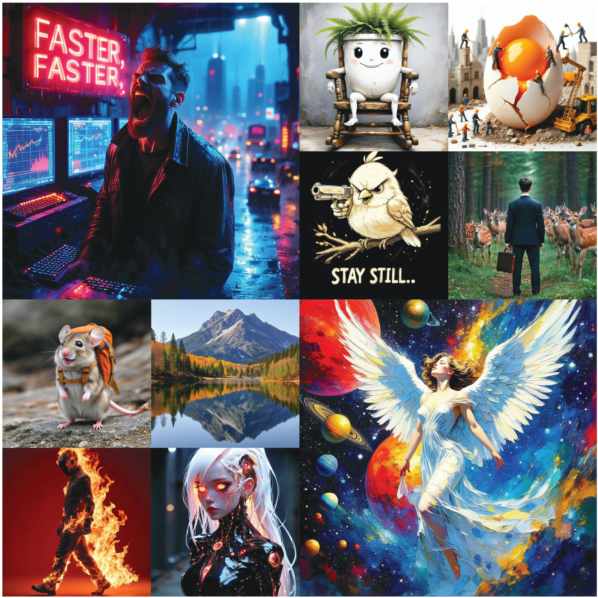
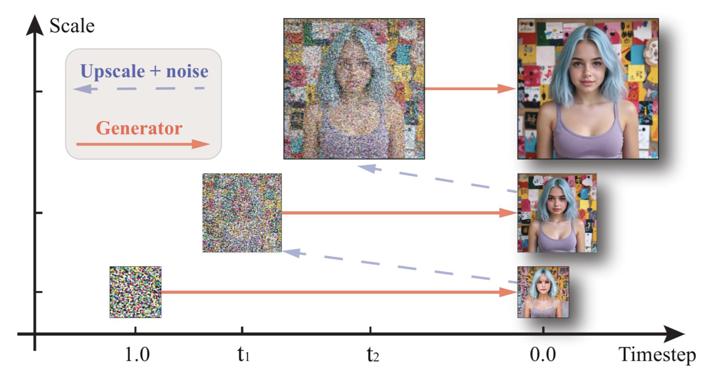

<h1 align="center">Scale-wise Distillation of Diffusion Models</h1>

<a href='https://arxiv.org/pdf/2503.16397'></a> &nbsp;
<a href='https://yandex-research.github.io/swd/'></a> &nbsp;
<a href="https://huggingface.co/spaces/dbaranchuk/SwD-FLUX"> </a> &nbsp;
<a href="https://huggingface.co/spaces/dbaranchuk/SwD-SD3.5-Large"> </a> &nbsp;
<a href="https://gist.github.com/dbaranchuk/c29ea632ae7563299b5131bb5d1e24e6"> </a> &nbsp;
<a href="https://github.com/YaroslavIv/comfyui_swd"></a> &nbsp;

<p align="center">

</p>

## 💡 Quick introduction
The paper introduces Scale-wise Distillation (SwD), a novel framework for accelerating
diffusion models by turning them into progressive few-step models.
Text-to-image SwD achieves ~2x speedup compared to full-resolution few-step alternatives while maintaining or even improving image quality.


<p align="center">

</p>


## 🔥 Inference

### HF 🤗 Models
We release four versions of SwD: `SDXL-SwD (2.6B)`, `SD3.5-Medium-SwD (2.2B)`, `SD3.5-Large-SwD (8B)` and `FLUX-SwD (12B)`. <br>

SwD requires two key arguments: `scales` and `sigmas`.
- `scales` defines a sequence of spatial latent resolutions used during the progressive sampling.
- `sigmas` corresponds to the few-step timestep schedule.

| Model                                                                  | Scales                                                 | Sigmas
|:-----------------------------------------------------------------------|:-------------------------------------------------------|:--------------------------------------------|
| [SD3.5-M-SwD, 6 steps](https://huggingface.co/yresearch/swd-medium-6-steps) (default) | 32, 48, 64, 80, 96, 128                                        | 1.0000, 0.9454, 0.8959, 0.7904, 0.7371, 0.6022, 0.0000
| [SD3.5-M-SwD, 4 steps](https://huggingface.co/yresearch/swd-medium-4-steps) | 64, 80, 96, 128                                        | 1.0000, 0.8959, 0.7371, 0.6022, 0.0000
| [SD3.5-L-SwD](https://huggingface.co/yresearch/swd-large-4-steps)  | 64, 80, 96, 128                                        | 1.0000, 0.8959, 0.7371, 0.6022, 0.0000              |                                            |
| [FLUX-SwD](https://huggingface.co/yresearch/swd_flux)         | 64, 80, 96, 128                                        | 1.0000, 0.8959, 0.7371, 0.6022, 0.0000              |
| [SDXL-SwD](https://huggingface.co/yresearch/swd-sdxl)*         | 64, 80, 96, 128                                        | 1.0000, 0.8000, 0.6000, 0.4000, 0.0000              |

(*) This checkpoint was trained using only the MMD loss, as discussed in the paper.

Upgrade to the latest version of [🧨 diffusers](https://github.com/huggingface/diffusers)
and [🧨 peft](https://github.com/huggingface/peft)
```
pip install -U diffusers
pip install -U peft
```

### 📌 FLUX-SwD
```py
import torch
from diffusers import FluxPipeline
from peft import PeftModel

pipe = FluxPipeline.from_pretrained("black-forest-labs/FLUX.1-dev",
                                    torch_dtype=torch.float16,
                                    custom_pipeline="quickjkee/swd_pipeline_flux").to("cuda")
lora_path = "yresearch/swd_flux"
pipe.transformer = PeftModel.from_pretrained(
    pipe.transformer,
    lora_path,
)

sigmas = [1.0000, 0.8956, 0.7363, 0.6007, 0.0000]
scales = [64, 80, 96, 128]
prompt = "Cute winter dragon baby, kawaii, Pixar, ultra detailed, glacial background, extremely realistic."

image = pipe(
    prompt=prompt,
    height=int(scales[0] * 8),
    width=int(scales[0] * 8),
    scales=scales,
    sigmas=sigmas,
    timesteps=torch.tensor(sigmas[:-1], device="cuda") * 1000,
    guidance_scale=4.5,
    max_sequence_length=512,
).images[0]
```

### 📌 SD3.5-L-SwD
```py
import torch
from diffusers import StableDiffusion3Pipeline
from peft import PeftModel

pipe = StableDiffusion3Pipeline.from_pretrained("stabilityai/stable-diffusion-3.5-large",
                                                torch_dtype=torch.float16,
                                                custom_pipeline="quickjkee/swd_pipeline").to("cuda")
lora_path = "yresearch/swd-large-4-steps"
pipe.transformer = PeftModel.from_pretrained(
    pipe.transformer,
    lora_path,
)

prompt = "Cute winter dragon baby, kawaii, Pixar, ultra detailed, glacial background, extremely realistic."
sigmas = [1.0000, 0.8956, 0.7363, 0.6007, 0.0000]
scales = [64, 80, 96, 128]

image = pipe(
    prompt,
    sigmas=sigmas,
    timesteps=torch.tensor(sigmas[:-1], device="cuda") * 1000,
    scales=scales,
    guidance_scale=1.0,
    height=int(scales[0] * 8),
    width=int(scales[0] * 8),
    max_sequence_length=512,
).images[0]
```

### 📌 SDXL-SwD
```py
import torch
from diffusers import DDPMScheduler, StableDiffusionXLPipeline
from peft import PeftModel

pipe = StableDiffusionXLPipeline.from_pretrained(
    "stabilityai/stable-diffusion-xl-base-1.0",
    torch_dtype=torch.float16,
    custom_pipeline="quickjkee/swd_pipeline_sdxl",
).to("cuda")

pipe.scheduler = DDPMScheduler.from_pretrained(
    "stabilityai/stable-diffusion-xl-base-1.0",
    subfolder="scheduler",
)

lora_path = "yresearch/swd-sdxl"
pipe.unet = PeftModel.from_pretrained(
    pipe.unet,
    lora_path,
)

prompt = "Cute winter dragon baby, kawaii, Pixar, ultra detailed, glacial background, extremely realistic."
sigmas = [1.0000, 0.8000, 0.6000, 0.4000, 0.0000]
scales = [64, 80, 96, 128]

image = pipe(
    prompt,
    timesteps=torch.tensor(sigmas) * 1000,
    scales=scales,
    height=1024,
    width=1024,
    guidance_scale=1.0,
).images[0]
```
<p align="center">

</p>

## Training

We provide the training code for `SD3.5-Medium-SwD` and `SD3.5-Large-SwD`.

### Environment

```bash
conda create -n swd python=3.12 -y
conda activate swd

pip install -r requirements.txt
```

### Datasets

We provide 200K teacher-generated images and their prompts for training. To download the datasets, run one of the following scripts:

##### SD3.5-M
```bash
sh data/download_sd35_medium_train_data.sh
```
##### SD3.5-L
```bash
sh data/download_sd35_large_train_data.sh
```

### Training scripts
The following training scripts were tested on 8 A100 GPUs:

##### SD3.5-M-SwD
```bash
sh train_sd35_medium.sh
```
##### SD3.5-L-SwD
```bash
sh train_sd35_large.sh
```

A quick note on the `--boundaries` argument.
In the training scripts, it is set to `0 7 14 18 28` according to the `--num_timesteps` parameter, which is set to `28` in `main.py` .
In other words, under the current timestep schedule this corresponds to: ``timesteps[0] = 999, timesteps[7] = 896, ..., timesteps[28] = 0``, as specified in Appendix C of the paper.

## Citation

```bibtex
@inproceedings{
    starodubcev2026scalewise,
    title={Scale-wise Distillation of Diffusion Models},
    author={Nikita Starodubcev and Ilya Drobyshevskiy and Denis Kuznedelev and Artem Babenko and Dmitry Baranchuk},
    booktitle={The Fourteenth International Conference on Learning Representations},
    year={2026},
    url={https://openreview.net/forum?id=Z06LNjqU1g}
}
```
